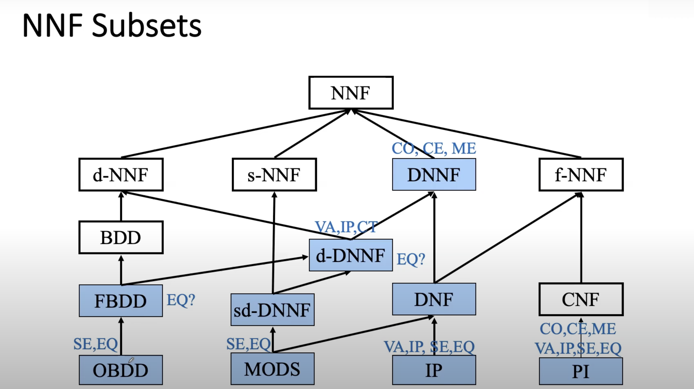

# NNF 和 对应拓展

## NNF

- 输入为variable以及variable的否定，由与或门组成的逻辑网络
- 这是一种最常见的逻辑网络，我们没办法做什么

## DNNF

- 在NNF的基础上，要求每一个and节点的任意两个分支所涉及的节点交集为空（no overlap）
- 在这个网络上，NNF的可行性可以被简单地验证
- 我们可以在多项式时间内执行：CO, CE, ME这三个任务

> 任务汇总：  
> CO: consistency  
> VA: Validity  
> SE: sentential entailment  
> **CE: clausal entailment(KB implies clause)**  
> IP: implicant testing(term implies KB)  
> EQ: equivalence testing  
> CT: model countig  
> ME: model enumeration 

- DNNF能够在线性时间内完成clause entailment

> 如果一个NNF子图能够在线性时间内完成clause entailment，我们称之为tractable。DNNF是tractable的。

## dNNF

- 在NNF的基础上，要求每一个or节点的任意两个分支的输入之间互斥

> E.g.  $(\neg A \land B) \lor (A \land \neg B)$ 就是互斥的

- 这意味着无论你怎么取值，or节点的不可能有两个输入同时为true 
- dNNF不是tractable的

## sNNF

- "smoothness"，在NNF的基础上，要求每一个or节点的任意两个分支所涉及的参数必须相同。
- sNNF不是tractable的。

## d-DNNF

- 顾名思义，同时满足dNNF和DNNF。
- d-DNNF是tractable的。
- d-DNNF可以在多项式时间内实现VA， IP， CT任务。

## sd-DNNF

- 同时满足dNNF和DNNF和sNNF
- tractable。

## f-NNF

- flatness or shallow circuit
- 满足性质：网络仅仅只有两层
- Simple conjunction：由or-and-variable组成，且每个and下的variable均各不相同，我们可以将这种网络改写为DNF形式。
- Simple conjunction同时满足decomposity性质。
- Simple disjunction，CNF，同上。
- f-NNF和CNF不是tractable。但是DNF是tractable的。

## PI

- prime Implicates, 是一种特殊的CNF，要求CNF满足：
    - 没有一个clause是其他clause的子集（都是有用的clause）
    - 如果可以进行resolution，那么resolution的结果一定本来就可以被其中某个clause imply。
- DNF的版本称之为IP
- PI来自于CNF， 可以在多项式时间内解决CO, CE, ME, VA, IP, SE, EQ问题
- IP来自于DNF，可以额外在多项式时间内解决VA, IP, SE, EQ问题。

## BDD

- decision graph： variable的取值由其parent决定。
- 同时还是decomposition。

## FBDD

- test one property：从任何一条根节点到叶子节点的路径上，每一个variable都只能出现一次
- 是在d-DNNF和BDD的基础上的，因此他可以在多项式时间内解决七个问题。

## OBDD

- 在任意从根节点到叶子节点的路径上，都满足同一variable的顺序
- decision decomposability order
- 可以在多项式时间内完成SE， EQ任务，因此它在多项式时间内可以完成所有的任务。

