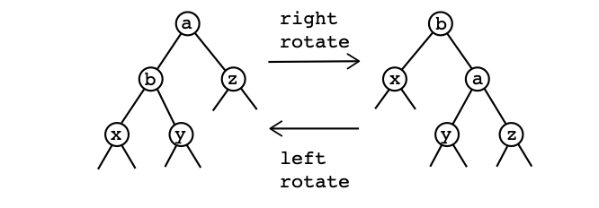
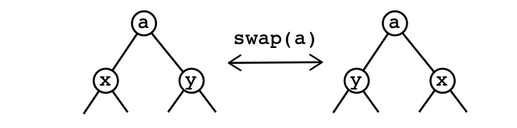
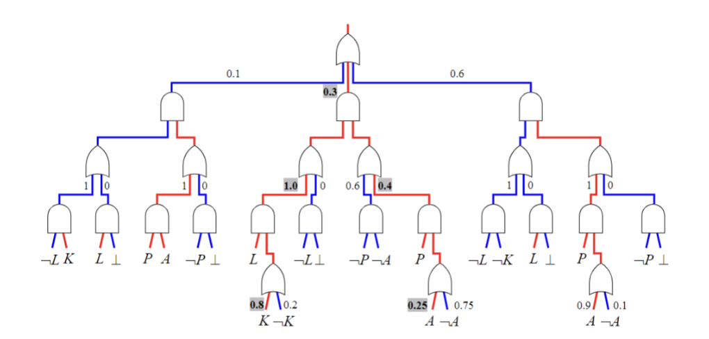

We will start from SDD. And previous content will be posted later.

# SDD 

SDD is a kind of OBDD, which means the order of variable is needed in such circuit. And SDD is unique when canonical / reduced.

## Structured Decomposability

Decomposability:  

> f(ABCD) = $(g_1(AB) \land h_1(CD)) \lor (g_2(A) \land h2(BCD)) \lor ...$

Structured Decomposability:   

> f(ABCD) = $(g_1(AB) \land h_1(CD)) \lor (g_2(AB) \land h2(CD)) \lor ...$

The difference between these two kinds of decomposability is whether variables split in the same way in each subfunction.

Definition of Structured Decomposability:
> A (X,Y)-partition of a function f goes like:
> $$f(X, Y) = g_1(X)h_1(Y) + ... + g_n(X)h_n(Y)$$
> Where $X \land Y = \empty$ and $X \lor Y$ = all variables in f.  
> $g_i$ regarding X is called a prime and $h_i$ regarding Y is called a sub, which requires that:  
> $$ \forall i, j, \ g_i \land g_j = False $$
> $$g_1 \lor g_2 ...\lor g_i = True$$
> $$\forall i, \ g_i \neq False $$

A (X,Y)-partition is compressed if there is no equal subs. That is,
$$h_i \neq h_j\ \ \  \forall i \neq j$$

## Vtree
Vtree is a binary tree that denotes the order and the structure of a SDD. Each node’s left branch refers to the element in the primes, and each node’s right branch refers to that of the subs.  

OBDD is a special case of SDD with right-linear a vtree, whose left branch is always a leaf.  

SDD is a strict superset of OBDD, maintaining key properties of OBDD b, and could be exponentially smaller than OBDD.

## Building a SDD
For example, we have $f = (A \land B) \lor (B \land C) \lor (C \land D)$ and X = {A, B}, Y = {C, D}.

Then we can have the sub-functions (subs) as condi-
tioned on the primes:
| prime                 | sub         |
|-----------------------|-------------|
| $A \land B$           | True        |
| $A \land \neg B$      | $C \land D$ |
| $\neg A \land B$      | C           |
| $\neg A \land \neg B$ | $C \land D$ |

Resolving the primes with the same sub, to conduct compression:
| prime            | sub         |
|------------------|-------------|
| $A \land B$      | True        |
| $\neg B$         | $C \land D$ |
| $\neg A \land B$ | C           |

Then we could have f = ($A \land B$)(True) + ($\neg A \land B$)(C) + ($\neg B$)($C \land D$)

For Vtree, if X and Y are fixed, the leaves under the left branch of the root has to contain and only contain variables belong to X, and right branch for Y. For intermediate nodes (neither leave nor root), do the same recursively.

Then we can construct the SDD according to the Vtree and f.   

Each node consists of a head and a tail; for either a head or a tail, if it involves more than one variable (a.k.a representing an intermediate node in the vtree), we need to decompose it again (according to its left-right branches in the vtree).

__Most importantly__: I have made this mistake in my Homework. After you constructing the SDD, you need to check whether this SDD can be reduced, that is, whether there are some node that are just the same. You need to combine these nodes.

## Polytiom Operation

if you have two (X,Y)-partition like:
$$f: (p_1, q_1) ... (p_n, q_n)$$
$$g: (r_1, s_1) ... (r_m, s_m)$$
Then for any logic operator &, we have:
$$f\  \& \ g : (p_i \land r_j, q_i\  \& \ s_j), \forall i, j, p_i \land r_j \neq False$$

## Bottom-Up Compliation for OBDD/SDD

If we want to compile a CNF:  
> First, we comstruct OBDD/SDD for literals.  
> Then, combine literals into clause.  
> Finally, combine all the literals into CNF.

Also works for DNF.

## Canonicity in Compilation

fixed variable order -> unique reduced OBDD
fixed vtree -> unique trimmed & compressed SDD

However, if we have n variable, then we can have n! kinds of variable order. Then we also have $C_{n-1}$ kinds of dissections(prime and sub). Then we will have:
$$n!\ *\ C_{n-1} = \frac{(2(n-1))!}{(n-1)!}$$
kinds of vtree in total.

## Operation on vtree

Tree rotate.

Tree swap.

Search over vtree

We would use greedy search to enumerate all the vtrees. First, we enumerate all vtree over a window, that is, all the vtrees that can be reachable via a certain amount of rotate/swap operations. Then we greedily accept the best vtree that has been found, and then move window.

# PSDD

probability space -> the truth table -> (world, instantiation, 1/0)

SDD -> Tractable Boolean Circuit

PSDD -> probabilistic -> (world, instantiation, Pr())

## From SDD to PSDD

PSDD, compared to SDD, is almost the same, except that:

- OR-gates: having probability distributions over all inputs.

- Any two OR-gates may have di↵erent probability distributions.

The AND-gates are just kept the same and no pro- bability applies.

## Calculating rule

If we have an input like L, K, P, A, and we need to calculate the probability of this world. We can do following sequencely.

- Firstly, we check bottom up. Find all leaves that statisfy the input. For or gate, we continue if one of its branch is selected, and for and gate, we continue only if all its branchs are selected.

- Then, we calculate top down. From the top gate, for or gate, we add all its selected branch, and for and gate, we multiply all its branches.

For example, in the above figure, we can have:
$$Pr(L, K, P, A) = 0.3 * 1.0 * 0.8 * 0.4 * 0.25$$

If our input does not contain all the literals, for example: L, P, A. Then we still could follow the above-mentioned steps and we can have:
$$Pr(L, P, A) = 0.3 * 1.0 * 1.0 * 0.4 * 0.25$$

# Prime Implicate and Prime Implicant

Firstly, in this section, we denote $\Delta$ as the knowledge base.

Most importantly, we denote prime Implicate (CNF) as PI and prime implicant (DNF) as IP.

PI: CNF that contains no subsumed clauses.  
IP: DNF that contains no subsumed terms.

To obtain PI: close $\Delta$ under resolution then drop subsumed clauses.  
To obtain IP: close $\Delta$ under consensus then drop subsumed terms.

> P.S. remember! When you are doing resolution/consensus, you can only invlove one literal, that is, you can not do resolution on (A, B, C) and (A, $\neg B$, $\neg C$).

Subsume: all-literals already contained.  
Clause: c1 subsumes c2 -> c1 is shorter than c2 -> c1 entails c2.  
terms: t1 subsumes t2 -> t1 is shorter than t2 -> t2 entail t1.

Duality: $\alpha$ is PI of $\Delta$, then $\neg \alpha$ is IP of $\neg \Delta$.

# Model-based Diagnosis

Model-based Diagnosis can be divided into several parts.

Firstly, we need to construct the system. For a given circuit, we will have several logic variables and several health variables. Each logic gate has a logic equation, that is, $OK_i \rightarrow $ logic equation of this gate.

We define the system observation $\alpha$ and then construct the model-based diagnosis as $\Delta \land \alpha \land OK_{situation}$. $OK_{situation}$ denotes the situation we need to diagnosis. For example, we suppose that OK1 and OK2 are both health, then we need to test $\Delta \land \alpha \land OK_1 \land OK_2$ is statisfiable. If so, then we can say that situation is normal, otherwise it is abnormal.

To do model-based diagnosis, we conclude all the normal assignment of the health variables and sinplify.

## Health condition

Health condition of system $\Delta$ given observation $\alpha$ is:  
$$Health(\Delta, \alpha) = \exists\ (all\ variables\ except\ health\ variables)\ \Delta \land \alpha$$
That is, projection of $\Delta \land \alpha$ onto health variables.

Based on health condition Health($\Delta$,$\alpha$) we can do model-based diagnosis:  

- Conflict: implicates of Health($\Delta$,$\alpha$).
- Min-conflict: PI of Health($\Delta$,$\alpha$). 
- Parlid: implicant of Health($\Delta$,$\alpha$).  
- Kernel: IP of Health($\Delta$,$\alpha$). 

# Classifier

Function version of a classifier:
$$f(x_1, x_2, ..., x_n)$$
- $x_i$ are called features.   
- all features $x_1,x_2,...x_n$ together: instance.   
- output of f: decision (classifica- tion);    
- positive/negative decision refer to f = 1/0 respectively, while the corresponding instances are called positive/negative instantiation.

Boolean Classifier: $x_i$, f have Boolean values.

Monotone Classifier: positive instance remains
positive if we flip some features from negative to positive.

# Explainable AI

Universal Literal Quantification.  
For binary variable:
$$\forall x . \Delta = \Delta|x \land (x \lor \Delta|\neg x) $$
For discrete values variables:
$$\forall x_i . \Delta = \Delta|x_i \land \land_{j\neq i}(x_i \lor \Delta|x_j)$$

General Universal Literal Quantification.   
$$\hat{\forall} x_i . \Delta = \Delta|x_i \land \Delta $$
Alternatively,
$$\hat{\forall} x_i . \Delta = \Delta|x_i \land \land_{j\neq i}(\neg x_j \lor \Delta|x_j)$$

Now we can introduce the most important definitions in explainable AI.

- $\Delta$ is the class formula.  
- $I$ is the instance.  
- $\forall I . \Delta$ is complete reason.
- The PI of complete reason is Sufficient reasons.  
- The IP of complete reason is Necessary reasons.  
- $\hat{\forall} I . \Delta$ is general complete reason.
- The PI of general complete reason is Genral Sufficient reasons.  
- The IP of general complete reason is General Necessary reasons.

# Discrete Logic

