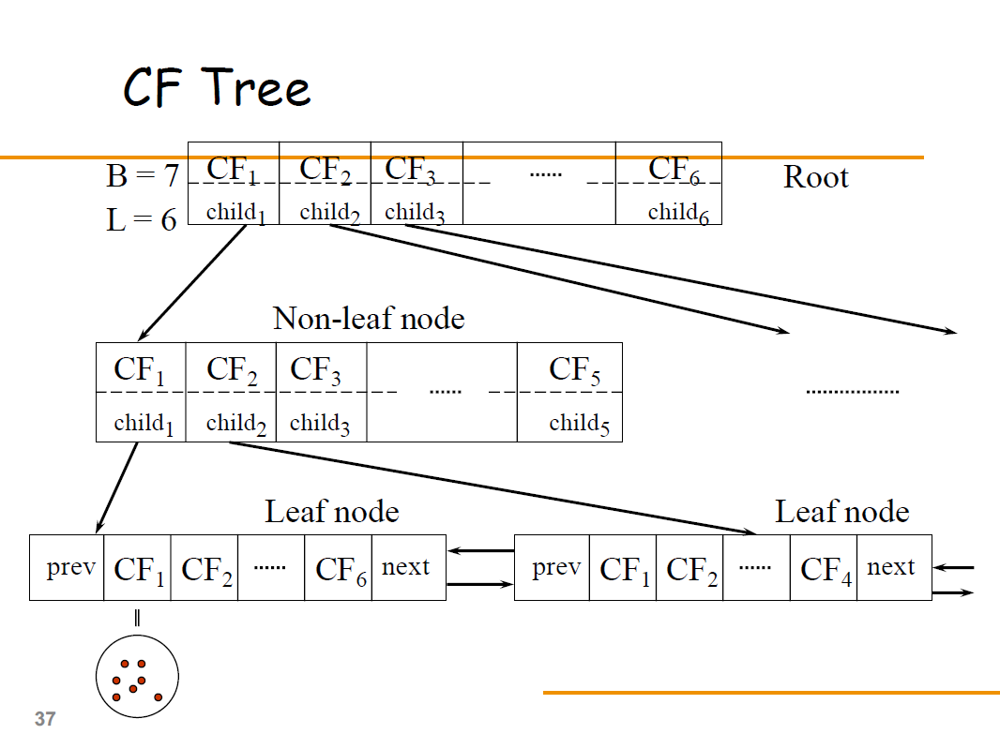
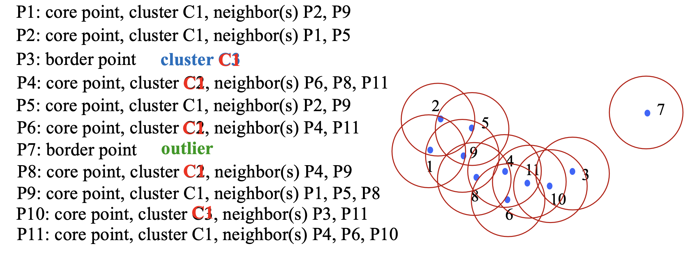

# Cluster

## Algorithm_1 K-means

- randomly choose initial cluster centroics.
- assign each point to its nearset centroic.
- do iteration until the location of any centroics does not change:
  - caluculate the mean value for every point of each cluster.
  - relocate every point.

## Algorithm_2 PAM

- Arbitrarily choose k objects as the initial medoids
- Until no change, do 
  - (Re)assign each object to the cluster to which the nearest medoid
  - Randomly select a non-medoid object o’, compute the total cost, S, of swapping medoid o with o’ 
  - If S < 0 then swap o with o’ to form the new set of k medoids

> **Swapping Cost:** Measure whether o’ is better than o as a medoid

## Algorithm_3 CLARA

- random sample in huge data
- do PAM

 > PAM search the whole graph  
 > CLARA search some random sub-graphs

## Algorithm_4 Hierarchical Clustering

 ### AGNES (agglomerative)

- Initially, each object is a cluster
- Step-by-step cluster merging, until all objects form a cluster

 ### DIANA (divisive)

- Initially, all objects are in one cluster
- Step-by-step splitting clusters until each cluster contains only one object

 ### More Details

- Single-Link（最短距离链接）：

> Single-Link聚类方法将两个簇之间的距离定义为它们中最接近的两个点之间的距离。换句话说，它测量了两个簇中最相似的成员之间的距离。这种方法倾向于形成具有长而窄的簇，因为它强调了局部相似性。Single-Link在处理非凸形状的簇时表现良好，但容易受到噪声和异常值的影响。

- Complete-Link（最长距离链接）：

> Complete-Link聚类方法将两个簇之间的距离定义为它们中最不相似的两个点之间的距离。它关注的是两个簇中最不相似的成员之间的距离。这种方法更倾向于形成具有更紧凑形状的簇，因为它强调了簇的全局相似性。Complete-Link对于处理不同大小和不同密度的簇效果较好，但可能会受到异常值的干扰。

## Algorithm_5 BIRCH

 > Clustering Feature:  CF = (N, LS, SS)  
 > N: #data points  
 > LS: sum of position  
 > SS: sum of the square of the position 

- Phase 1: scan DB to build an initial inmemory CF tree (a multi-level compression of the data that tries to preserve the inherent clustering structure of the data) 
- Phase 2: use an arbitrary clustering algorithm to cluster the leaf nodes of the CF-tree 

 > 一开始只有一个空的root，然后一个一个加进去，如果在已有节点的球体内，则合为一个cluster，如果一个cluster超过一定数量，则分裂：选择最远两个点最为两个新的cluster中心点，重新分配，保证树结构完整性。

## Algorithm_6 Distance-based Methods

### Previous Knowledge

- **Eps**: Maximum radius of the neighborhood
- **MinPts**: Minimum number of points in an Eps- neighborhood of that point
- **NEps(p)**: {q | dist(p,q) $\leq$ Eps}
- **Core object p**: |Neps(p)| $\ge$ MinPts
- Point q **directly density-reachable** from p iff q $\in$ Neps(p) and p is a core object
- **Density-reachable:** p1 $\rightarrow$ p2, p2 $\rightarrow$ p3, ..., pn-1 $\rightarrow$ pn then pn is density-reachable from p1
- **Density-connected:** Points p, q are density-reachable from o $\rightarrow$ p and q are density-connected

### DBSCAN

- Arbitrary select a point p
- Retrieve all points directly density-reachable from p wrt Eps and MinPts
- If p is a core point, a cluster is formed
- If p is a border point, no points are density- reachable from p and DBSCAN visits the next point of the database
- Continue the process until all of the points have been processed

 > P.S. 一个一个判断，如果是cluster，且范围内点已形成cluster，则加入，若无先前cluster，则新建立一个。若是后建立的和之前建立的通过一个点reachable了，则将两个cluster合为一个。